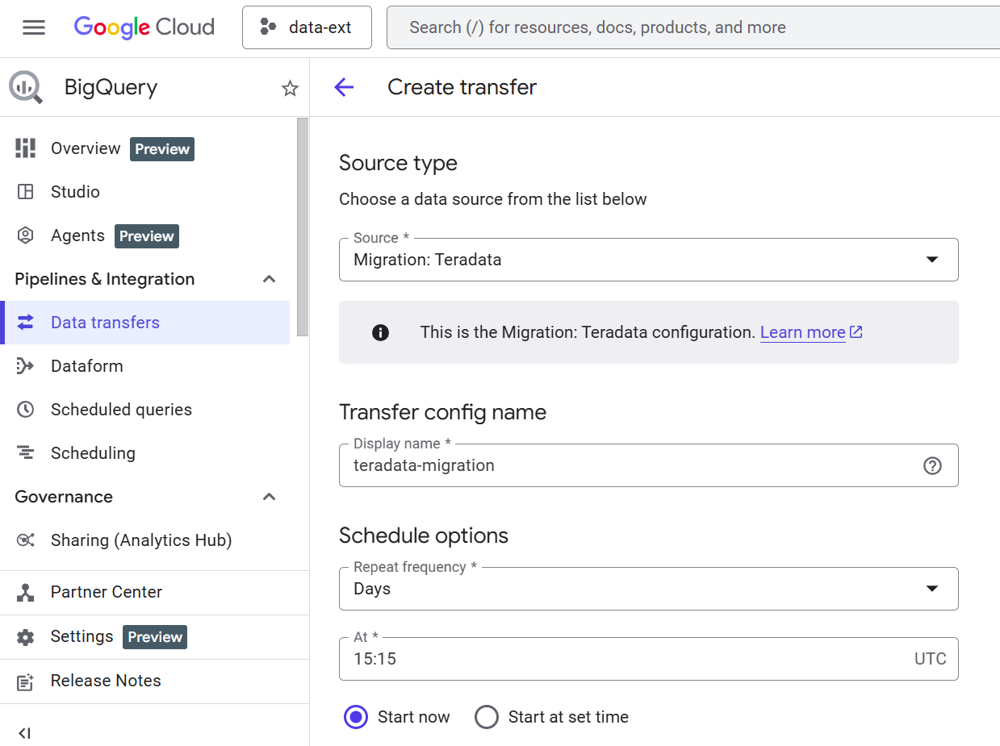
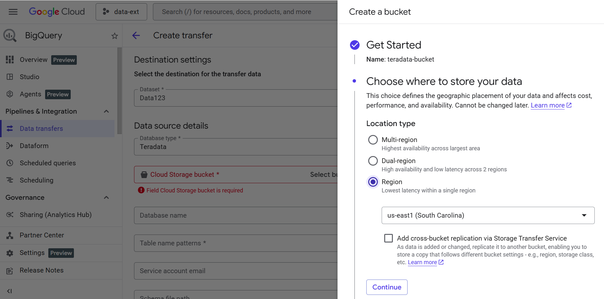
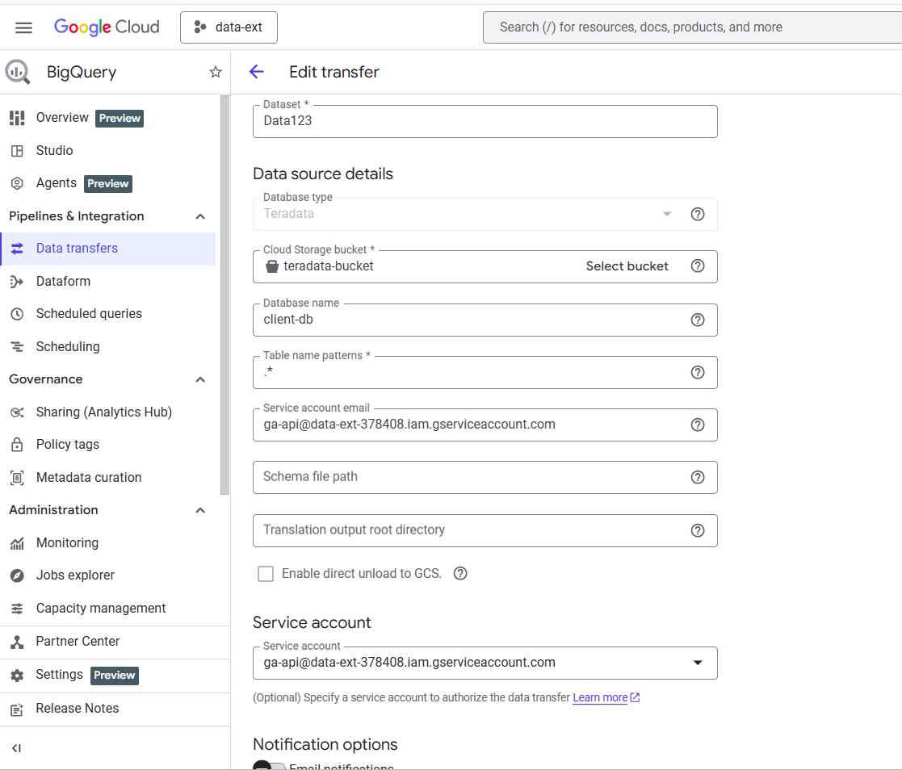
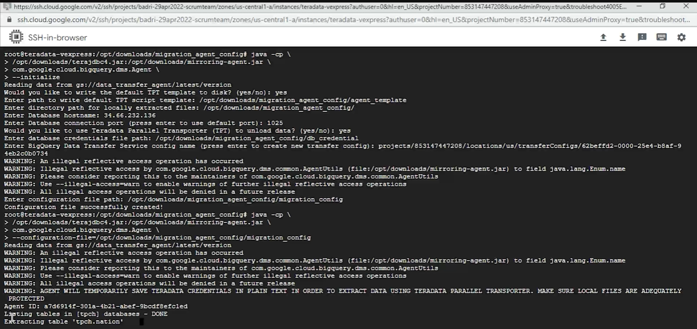
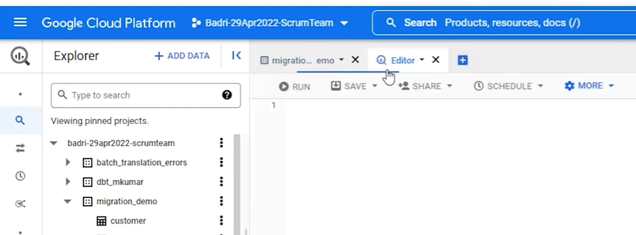

# 📘 Teradata to GCP BigQuery Migration – Step-by-Step Guide

This document explains how to migrate data from **Teradata** to **Google BigQuery** using the **BigQuery Data Transfer Service** and **Migration Agent**.

---

## ✅ Prerequisites

Before starting, ensure the following are in place:

### 🔐 IAM & Access
- A **GCP Service Account** with:
  - `BigQuery Admin`
  - `Storage Admin`

### ☁️ GCP Resources
- A **Cloud Storage bucket** for staging data
- A **BigQuery Dataset** to hold migrated tables

### 🖥 Compute & Runtime
- A **GCE VM** (Linux recommended)
- **Java Runtime Environment (JRE)** installed
- Network connectivity to Teradata

---

### 🛠 Step 1: Create BigQuery Data Transfer Service

1. Navigate to **BigQuery → Data Transfers**
2. Click **Create Transfer**
3. Configure:
   - **Source Type**: `Migration: Teradata`
   - **Display Name**: Unique transfer name
   - **Schedule**: As per migration requirement

📸 *Screenshot:*  


---

### 🗄 Step 2: Destination & Source Configuration

- **Destination Dataset**:
  - Choose an existing dataset or create a new one
- **Source Details**:
  - Select Teradata as the source
- **Cloud Storage Bucket**:
  - Use an existing bucket or create a fresh one
- **Database Name**:
  - Provide Teradata database name
- **Table Name Pattern**:
  - Use `.*` to migrate all tables

📸 *Screenshot:*  



---

### 🔔 Step 3: Notifications (Optional but Recommended)

- Enable:
  - 📧 Email notifications
  - 📣 Pub/Sub notifications (for production monitoring)
Save the data transfer created in GCP.
---

### 🖥 Step 4: Connect to GCE VM

Open **SSH-in-browser** to the GCE VM where migration will be executed.

---

### ⬇️ Step 5: Download Migration Agent

```bash
wget https://storage.googleapis.com/data_transfer_agent/latest/mirroring-agent.jar
```

Ensure terajdbc4.jar is available in the same or referenced directory.

### ⚙️ Step 6: Initialize Migration Agent
```bash
java -cp \
/opt/downloads/terajdbc4.jar:/opt/downloads/mirroring-agent.jar \
com.google.cloud.bigquery.dms.Agent \
--initialize
```

During initialization, provide:

. TPT script template path
```bash
/opt/downloads/migration_agent_config/agent_template
```

. Local extraction directory
```bash
/opt/downloads/migration_agent_config/
```

. Teradata Hostname
Example: 34.66.232.136

. Port
Default: 1025

. Confirm TPT unload → Yes

📸 Screenshot:
Follow the last screenshot for reference.


### 🔐 Step 7: Configure Credentials

Provide Teradata credentials file:

```bash
/opt/downloads/migration_agent_config/db_credential
```

### 🧾 Step 8: Provide Transfer Config Resource Name

Example:

```bash
projects/866169972146/locations/us/transferConfigs/69a42ad4-0000-2b87-8d29-34c7e918df53

```
### 📝 Step 9: Generate Migration Config File

```bash
/opt/downloads/migration_agent_config/migration_config

```

### ▶️ Step 10: Run Migration Agent

```bash
java -cp \
/opt/downloads/terajdbc4.jar:/opt/downloads/mirroring-agent.jar \
com.google.cloud.bigquery.dms.Agent \
--configuration-file=/opt/downloads/migration_agent_config/migration_config
```

📸 *Screenshot:*  


### ▶️ Step 10: Validate the data transfer in the new dataset created in GCP

📸 *Screenshot:*  



### ⚠️ Production Considerations

This project demonstrates a direct migration approach.

For real-world production use:

🔄 Implement incremental or CDC-based sync

🔐 Validate encryption requirements

📊 Perform row-level reconciliation

🧪 Test rollback and retry scenarios

🕒 Plan controlled cutover


#### ✅ Summary

This approach enables:

Minimal code migration

Native BigQuery ingestion

Scalable analytical workloads

It serves as a strong foundation for enterprise-grade Teradata modernization on GCP.